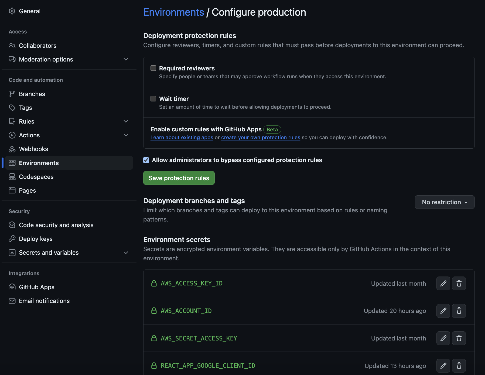

# Boilerplate app
I want to have boilerplate applications ready to build upon and deploy very quickly for whatever hare-brained idea I get, so this application will do that.

## Features
### Frontend
* TBD

### Backend
* TBD

## Technical details
### Frontend local setup
This is a React TypeScript application bootstrapped with Create React App. I'm ripping a lot of component code from [Ed Roh's React Admin Dashboard](https://github.com/ed-roh/react-admin-dashboard/), making it work with TypeScript, and building from there.

To install and run:
```bash
cd frontend
yarn # "yarn" by itself defaults to "yarn install"
yarn start
```

### Backend local setup
Python Flask app. 

```bash
cd backend
python -m venv .
source bin/activate # this will be ".\bin\activate.bat" if on Windows
python -m pip install --no-cache-dir -r requirements.txt

python app.py
```

## Deploy setup
### Prerequisites
You must have the following to execute this full-stack deploy.

* A Google Cloud OAuth client in GCP [instructions here](./oauth-client-create.md)
* an AWS account along with a programmatic access key configured on your computer
* a domain name in AWS with a Route 53 hosted zone
* AWS CLI V2 installed on your computer
* Docker Desktop installed on your computer

This app also utilizes Google Authentication, so you will need a Google Cloud account with a valid credit card on your billing account. I'll describe that setup in more detail later.

### Initial local setup
Run the following command in the root directory of this repo after cloning it:
```bash
git config --local core.hooksPath .githooks/
```

### Setting up HTTPS
The Github Actions script handles requesting an SSL certificate or using an existing suitable one, so the only domain-related things you will need before attempting to deploy this application is a registered domain name and an existing hosted zone for it in AWS. 

### Modifying forked/cloned/copied repo setup
To execute the Github Actions script if you're re-creating this in a new repo you own, you will need to add the following secrets to the Environments section in settings:
* AWS_ACCESS_KEY_ID
* AWS_ACCOUNT_ID
* AWS_SECRET_ACCESS_KEY
* REACT_APP_GOOGLE_CLIENT_ID

It'll look something like this in your settings:



You will also want to add `API_URL` in your environment (not secret) variables. Set its value as the FQDN you want for your API. This should be a subdomain of your main domain name. For example, I've been using "boilerplate-api.branson.solutions" for my API as a subdomain of "branson.solutions".

## Local setup
### Creating an ECR repository
You can execute the CFT in the root directory "ecr_repository_and_network_resources.yaml".

```bash
aws cloudformation create-stack --stack-name ECRRepository --template-body file://ecr_repository_and_network_resources.yaml --tags '[{"Key": "Author", "Value": "YOUR_NAME"}, {"Key": "Project", "Value": "Boilerplate Full-Stack App"}]' --parameters ParameterKey=RepositoryName,ParameterValue=REPOSITORY_NAME # replace with an actual repository name 
```

### Pushing your Docker images to the ECR repository
[AWS resources to push Docker images to ECR](https://docs.aws.amazon.com/AmazonECR/latest/userguide/docker-push-ecr-image.html)

Don't forget to start Docker Desktop before continuing!

#### Docker image creation
```bash
cd backend
docker buildx build --platform linux/amd64 -t full-stack-backend  . 
cd ../frontend
docker buildx build --platform linux/amd64 -t full-stack-frontend  . 
```

#### Push to ECR
```bash
aws ecr get-login-password --region AWS_REGION --profile default | docker login --username AWS --password-stdin AWS_ACCOUNT_ID.dkr.ecr.AWS_REGION.amazonaws.com
docker images # verify that the new images we created are in the output, we're gonna refer to them as IMAGE_ID_FOR_BACKEND and IMAGE_ID_FOR_FRONTEND moving forward
docker tag IMAGE_ID_FOR_BACKEND AWS_ACCOUNT_ID.dkr.ecr.AWS_REGION.amazonaws.com/REPOSITORY_NAME:full-stack-backend
docker tag IMAGE_ID_FOR_FRONTEND AWS_ACCOUNT_ID.dkr.ecr.AWS_REGION.amazonaws.com/REPOSITORY_NAME:full-stack-frontend
docker push AWS_ACCOUNT_ID.dkr.ecr.AWS_REGION.amazonaws.com/REPOSITORY_NAME:full-stack-backend
docker push AWS_ACCOUNT_ID.dkr.ecr.AWS_REGION.amazonaws.com/REPOSITORY_NAME:full-stack-frontend
```

## Stuff I've learned from building this thing
These are some tools with which I've had minimal experience but learned more about during this project:
* Docker
* AWS ECS/Fargate
* Github Actions
* MaterialUI for React
* Webpack

Here is a list of important lessons I learned from putting this together, in no particular order:

* ChatGPT is a fucking godsend. I've worked with folks who swear against it with statements like "it's just a smart web crawler" or "anything it can figure I can figure out". While both of those are somewhat true, I say to that mindset "it's a tool to solve your problems. Use it and solve problems better and faster than before." 
* Alpine Linux images with code runtime environments might need extra configuration for nontrivial projects. I was struggling for a while with a Node 18 Alpine Docker image in my frontend Dockerfile. It was never finishing "yarn build" even when left overnight. However, when I switched that to the Node LTS Docker image, "yarn build" finished rather quickly, and then I could still use an Alpine Nginx Docker image to actually serve the built application files.
* Creating and attaching certificates and DNS records has become easier in the past few years, with only part of that change due to generative AI.
* Github Actions is an perfectly fine CI/CD tool for what it is. It provides everything I need and nothing I don't need.
