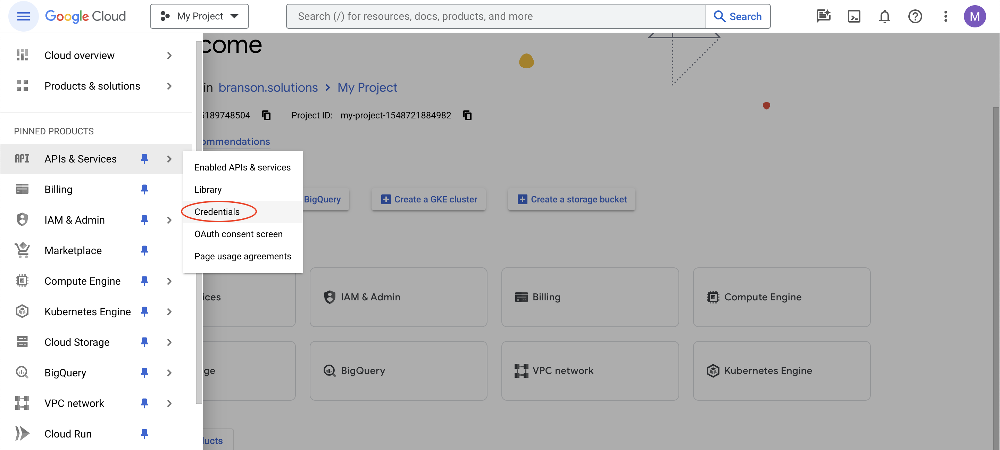
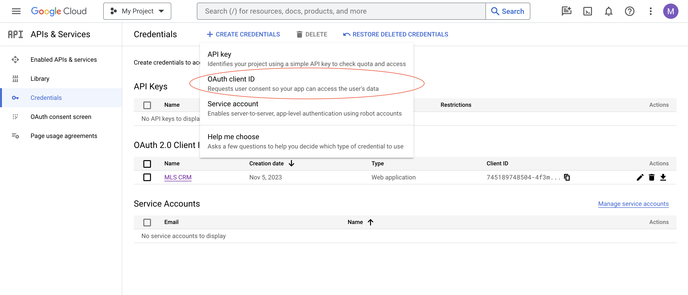
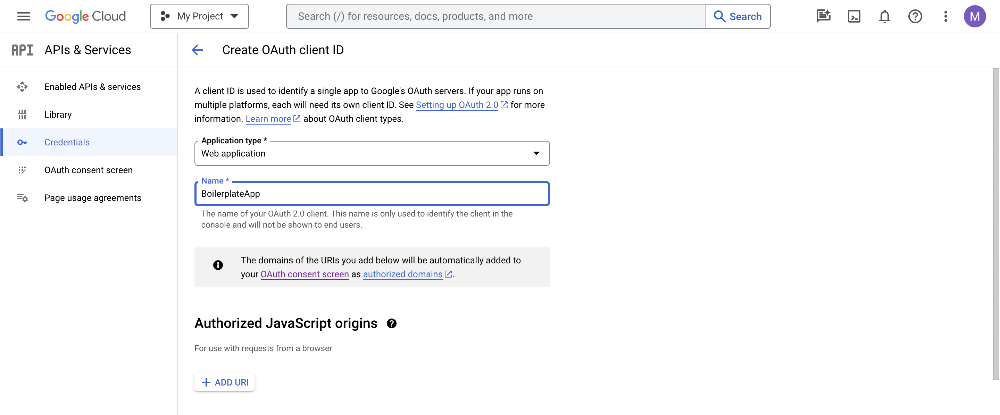
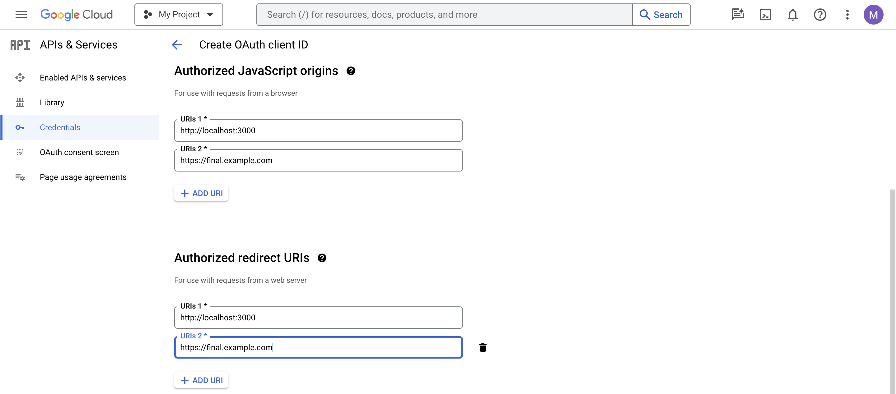
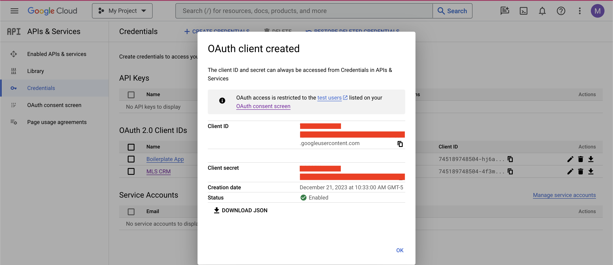

# Setting up the Google OAuth client in GCP
1. Login to GCP.
2. Find "Credentials" under the "APIs and Services" menu.

3. Create a new OAuth Client ID.

4. Select "Web" for **Application type**.
5. Name your application.

6. Add both your localhost URL and your intended final domain name for when you deploy the application to both the **Authorized JavaScript origins** and the **Authorized redirect URIs** sections.

7. Click "Create"
8. Save your client ID and secret somewhere safe.

Remember that you will need that client ID in your Github Actions environment variables to deploy this program as per the [README](./README.md). 